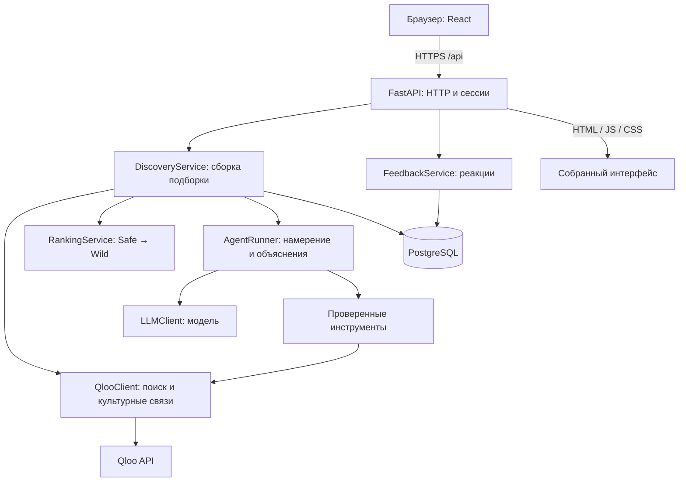

# Архитектура TasteShift

Актуализация 7 октября: реализован React-клиент Orbital Observatory с поиском интересов, подборкой, Safe → Wild, сохранением и показом агентного плана. Проверен браузерный путь через Qloo, Gemini, Docker API и PostgreSQL. Клиент использует обычный CSS и растровые WebP-ассеты, без Tailwind. В development Vite проксирует `/api`; production reverse proxy и публичный deployment пока не реализованы. Типы клиента пока поддерживаются вручную и проверяются тестами, генерация из OpenAPI остаётся следующим техническим улучшением.

Актуализация 6 октября: добавлены отдельный Qloo Taste Analysis профиль, проверенная explainability, `rank-tags-v2`, защита записи concurrent feedback и строгие входные схемы. Подробные результаты и ограничения публичного выпуска — в [backend review](backend-review.md). Ниже сохранён первоначальный архитектурный план, не перечень всех уже внедрённых возможностей.

Решение для первой рабочей версии, 4 октября 2026 года. Документ уточняет техническую часть [MVP](mvp-design.md). Выбор runtime описан в [архитектуре агента](agent-design.md), фактическое внедрение — в [отчёте](agent-implementation.md).

## Основное решение

Модульный монолит на Python: один сервер отвечает за API, интеграции, подбор рекомендаций и работу агента. В браузере работает React-приложение. В production сервер также отдаёт собранные файлы интерфейса, поэтому у приложения один адрес и один сервис развёртывания.

Python — основной язык продукта. TypeScript нужен для браузерных взаимодействий: поиск интересов, карточки, переключение уровня исследования и обратная связь.

## Стек

| Задача | Выбор | Причина |
| --- | --- | --- |
| Сервер | Python 3.12, FastAPI, Uvicorn | Типизированный API и асинхронные обращения к внешним сервисам |
| Схемы и настройки | Pydantic 2, pydantic-settings | Проверка запросов, ответов провайдеров и конфигурации |
| Внешние API | httpx.AsyncClient | Общие подключения, таймауты и контролируемая конкуренция |
| Хранение | PostgreSQL | Сессии, история подборок, реакции и снимки доказательств |
| Работа с БД | SQLAlchemy 2, asyncpg | Явные модели и асинхронные операции |
| Миграции | Alembic | Воспроизводимые изменения схемы |
| Интерфейс | React, TypeScript, Vite, Tailwind CSS | Интерактивный клиент; готовую сборку можно отдавать Python-сервером |
| Агент | Pydantic AI внутри Python-сервиса | Типизированные инструменты, контекст запуска и проверка выбранных ID; отдельный бюджет внешних запросов |
| Python-зависимости | uv, pyproject.toml, uv.lock | Воспроизводимое окружение |
| Проверки | pytest, pytest-asyncio, Ruff; Playwright для главного сценария | Проверка алгоритма, интеграций и пользовательского пути |
| Запуск | Docker; Docker Compose локально | Одинаковая сборка приложения и локальная PostgreSQL |
| Автоматические проверки | GitHub Actions | Проверки Python, сборка клиента и тесты перед выпуском |

Точные версии библиотек фиксируются в lock-файлах при создании каркаса и проверяются совместной установкой. Таблица не означает, что зависимости уже установлены.

В прежнем плане был Next.js с отдельным frontend-развёртыванием. Здесь выбираем Vite: MVP не требует серверного рендеринга, а один Python-сервис упрощает эксплуатацию. SSR можно пересмотреть, если появятся публичные индексируемые страницы подборок.

## Схема



## Границы модулей

**API** принимает запросы, определяет сессию, проверяет входные данные и возвращает DTO. В обработчиках не живёт алгоритм рекомендаций.

**DiscoveryService** организует один запуск: берёт интересы и реакции, получает кандидатов, вызывает ранжирование, добавляет проверенные объяснения и сохраняет результат.

**QlooClient** — единственное место с endpoint, заголовками и параметрами Qloo. Преобразует ответы в наши `Entity` и `Candidate`. Остальной код не зависит от внешнего JSON. Различает отсутствие данных, ошибку доступа, ограничение частоты и сбой сервиса.

**RankingService** — чистые Python-функции. Получает кандидатов, подтверждённые интересы, исключения и уровень Safe → Wild. Возвращает выбранные ID, порядок и причину выбора. Не обращается к БД или модели; поэтому алгоритм можно проверить отдельно.

**AgentRunner** принимает намерение и выбирает разрешённые шаги: просмотреть загруженных кандидатов, уточнить доступные метаданные, сформировать план. Цикл выполняет Pydantic AI, инструменты и проверку ID/evidence контролирует сервер. На запуск действуют общий deadline, предел запросов и размер контекста. Не нужен отдельный сервис или LangGraph для первого сценария. Модуль подключён к приложению; живое качество модели ещё не проверено.

**LLMClient** изолирует модель и её протокол. Конкретный провайдер и модель определяются при интеграции по качеству структурированного ответа, стоимости и задержке. Модель получает ограниченный набор сущностей и evidence ID, а её результат повторно проверяется Pydantic и правилами приложения.

**FeedbackService** сохраняет явные реакции. Сохранённое можно использовать как положительный сигнал, отклонённое исключается. «Уже знаю» не трактуется как отрицательный вкус. Повторная отправка той же реакции не создаёт дубль.

**Repositories** содержат операции хранения и границы транзакций. SQLAlchemy-модели не выходят в публичные ответы API.

## Один запрос рекомендаций

1. Браузер отправляет подтверждённые Qloo ID, уровень и необязательное намерение.
2. Сервер проверяет сессию, ID, длины полей и лимит активных запусков.
3. DiscoveryService читает профиль и реакции в короткой транзакции, затем закрывает её.
4. Агент при наличии намерения составляет разрешённый план получения кандидатов. Базовый запрос без намерения использует стандартный план.
5. QlooClient получает кандидатов по музыке, фильмам и книгам с ограниченной конкуренцией. Ошибка одной категории не уничтожает успешные результаты других.
6. RankingService исключает неподходящие и повторяющиеся сущности, применяет уровень исследования и выбирает до шести результатов.
7. Агент объясняет подборку на основании полученных данных. Сервер проверяет ID, ссылки на evidence и допустимые поля. При ошибке модели остаются рекомендации с фактическими пояснениями.
8. В новой короткой транзакции сохраняются входной снимок, версия политики, выбранные сущности и evidence. Клиент получает сохранённый результат.

Сетевые вызовы не выполняются внутри открытой DB-транзакции. Для параллельных операций нельзя разделять один `AsyncSession`; каждая независимая операция хранения использует свою сессию.

Первая версия держит запрос открытым в пределах общего таймаута. Повторные POST защищены ключом идемпотентности, привязанным к сессии и содержимому запроса. При превышении времени клиент получает понятную возможность повторить действие. Запись незавершённого запуска не выдаётся за готовую подборку.

## Как работает Safe → Wild

Qloo формирует релевантный пул. Наш Python-алгоритм меняет выбор внутри этого пула: Safe больше учитывает близость, Wild — расстояние по доступным тегам и разнообразие. Уже известные сущности исключаются независимо от уровня.

Оценки нормализуются внутри категории. Числа из разных категорий не сравниваются напрямую без подтверждённого контракта Qloo. Расстояние по тегам — наша эвристика, не вероятность того, что рекомендация понравится.

Каждая рекомендация должна сохранять поддержку входными сигналами. Если Qloo не отдаёт достаточные метаданные, сервер возвращает ограниченную подборку и явное описание покрытия. Точные веса и пороги определяются после проверки настоящих ответов API.

## База данных

| Таблица | Что хранит |
| --- | --- |
| sessions | Анонимную сессию и срок действия; хэш секретного токена |
| taste_seeds | Подтверждённые интересы и источник явного сигнала |
| discoveries | Входной снимок, уровень, версию алгоритма, статус и ключ идемпотентности |
| discovery_items | Порядок карточек, сущности и необходимые метаданные |
| evidence | Источник, тип подтверждения и снимок доступных данных для объяснения |
| feedback | Реакции текущей сессии на показанные сущности |
| experiences | Проверенный план, связанный с сохранённой подборкой |

Ссылки между таблицами защищаются внешними ключами. Уникальные ограничения защищают идемпотентные записи. Индексы нужны по сессии, discovery ID и сроку действия. Метаданные провайдера, структура которых меняется, хранятся в ограниченных JSONB-полях; связи и статусы остаются обычными колонками.

## API

| Метод | Endpoint | Результат |
| --- | --- | --- |
| GET | `/api/entities/search` | Поиск кандидатов для подтверждения интересов |
| POST | `/api/discoveries` | Новая подборка |
| GET | `/api/discoveries/{id}` | Сохранённая подборка текущей сессии |
| POST | `/api/discoveries/{id}/feedback` | Сохранённая реакция |
| POST | `/api/discoveries/{id}/experience` | План из сущностей этой подборки |
| GET | `/api/health` | Проверка доступности процесса |
| GET | `/api/ready` | Готовность сервера и БД; без платного запроса к провайдерам |

Публичные схемы определяются в Pydantic. OpenAPI используется для генерации клиентских типов, чтобы не поддерживать две разные версии контракта вручную. Несуществующая и чужая подборка дают одинаковый ответ 404.

## Структура репозитория

```text
tasteshift/
  backend/
    pyproject.toml
    uv.lock
    src/tasteshift/
      main.py
      config.py
      api/                 # routes, DTO, dependencies
      domain/              # entity, candidate, evidence, feedback
      services/            # discovery, ranking, feedback, experience
      agent/               # runner, tool registry, response validation
      integrations/        # qloo client, model client
      storage/             # SQLAlchemy models, repositories, sessions
    migrations/
    tests/
  frontend/
    src/
    package.json
    package-lock.json
  docs/
    mvp-design.md
    architecture.md
  Dockerfile
  compose.yaml
  .env.example
```

Это целевая структура, а не перечень уже созданных файлов. Создаём модули по мере реализации, без пустых абстракций и универсальных плагинных систем.

## Развёртывание

Один Docker-образ собирается в два этапа: Node собирает клиент, затем Python-образ получает backend и статические файлы. Node не нужен во время работы production-сервера. FastAPI обслуживает `/api` и статические ресурсы; SPA fallback не перехватывает неизвестные API-маршруты.

Для первого публичного запуска достаточно одного app-сервиса с Uvicorn и отдельной управляемой PostgreSQL. Render или Railway — варианты размещения; окончательный выбор зависит от аккаунта, лимитов и бюджета. HTTPS обеспечивает платформа. Alembic запускается отдельным шагом выпуска до старта приложения. Локально Compose поднимает PostgreSQL, а Vite проксирует `/api` на FastAPI.

Сначала один процесс приложения: небольшой общий семафор ограничивает обращения к провайдерам, а DB-backed лимиты сессии и общий бюджет защищают квоту. При нескольких процессах общий лимитер нужно вынести из памяти в совместное хранилище. Redis и отдельный worker добавляются, если появляются длительные задания или реальные требования к масштабу.

## Конфигурация и эксплуатация

Секреты: `QLOO_API_KEY`, `GEMINI_API_KEY`, `DATABASE_URL`. Остальные настройки: `QLOO_BASE_URL`, `MODEL_NAME`, `APP_ORIGIN`, таймауты, бюджеты запросов и срок хранения сессии. `.env` исключён из Git; `.env.example` не содержит реальных ключей. Адаптер использует Gemini Developer API; настройка бесплатного проекта описана в [инструкции](gemini-setup.md).

Сессия использует случайный секретный токен в Secure/HttpOnly/SameSite cookie. Сервер проверяет Origin для изменяющих запросов. Все данные доступны только владельцу сессии. Выходные URL разрешают только безопасные HTTP(S)-адреса; backend не загружает произвольные пользовательские URL.

Логи содержат request ID, длительность, код ошибки, количество вызовов и версию ранжирования. Ключи, секреты сессии и полный пользовательский текст не логируются. Ошибки провайдеров не возвращаются клиенту с заголовками или внутренним контекстом.

## Порядок внедрения

1. Проверить Qloo с реальным ключом: поиск, три категории, данные для расстояния и evidence. Зафиксировать адаптер и записи ответов без секретов.
2. Создать FastAPI, PostgreSQL, миграции и первый рабочий запрос поиска.
3. Реализовать чистое ранжирование и подборку с сохранением результата.
4. Подключить ограниченного агента, проверки его ответов и реакции пользователя.
5. Собрать React-клиент, подключить API и проверить основной сценарий.
6. Собрать Docker-образ, выполнить CI, миграции и публичный запуск с живыми провайдерами.

Проверки: адаптер Qloo, исключения и детерминированность ранжирования, изменение разнообразия между уровнями на записанных данных, запрет придуманных ID агентом, изоляция сессий, идемпотентность и частичные сбои. До развёртывания — один сквозной browser-тест и проверка реального hosted-запуска.

## Источники

- [FastAPI: асинхронные операции](https://fastapi.tiangolo.com/async/).
- [SQLAlchemy: asyncio и границы AsyncSession](https://docs.sqlalchemy.org/en/20/orm/extensions/asyncio.html).
- [Vite: production-сборка](https://vite.dev/guide/build.html).
- [Qloo: руководство хакатона](https://docs.qloo.com/reference/qloo-llm-hackathon-developer-guide).
